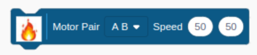
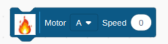
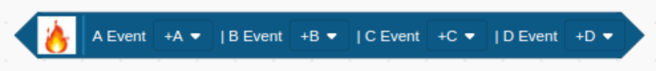
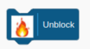

Fire Scratch provides blocks which connect to Google Firebas.

## The online version of fire Scratch launchable [here.](https://oliverfaust.github.io/)

## Motor Pair Block
Generate pulse width modulated signals on two raspberry-pi output pins.

Parameters:

Motor pair: Drop down to select the motors to drive.

Speed: Two integer input fields to set the motor speed. Valid values 0 .. 255.

## Motor Single Block

Generate a pulse width modulated singal on one raspberry-pi output pin.

Parameters:

Motor pair: Drop down to select the motor to drive.

Speed: One integer input field to set the motor speed. Valid values 0 .. 255.

## Stepper Motor Block

Asssociate upto four stepper motors with four distinct events events. Each stepper motor can be associated with one or multiple events. An event can also be associated with no stepper motor. An event is a level change from 0 to 1 on a raspberry pi input pin. Blockning connection.  

Parameters:
A Event

Motor and direction

## Unlock Block

Unlock a blocking connection. 

